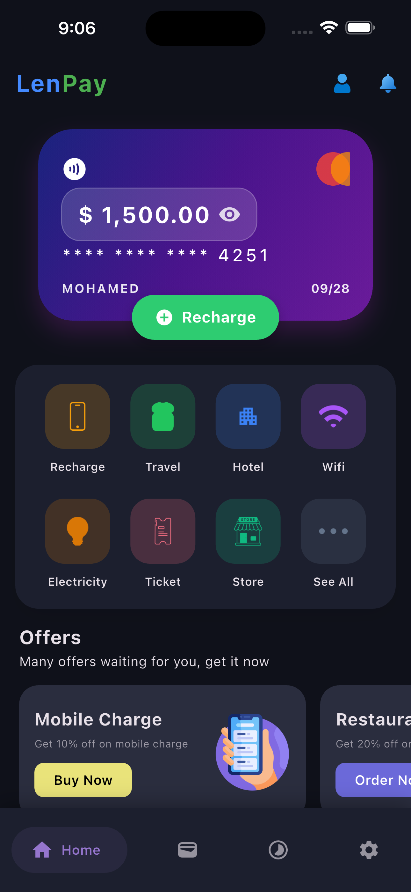
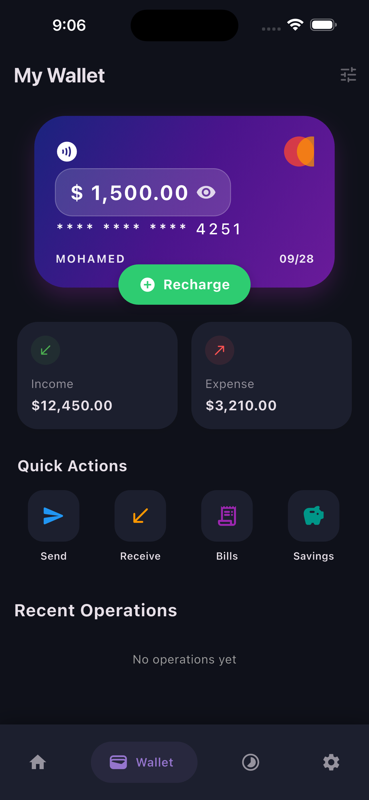
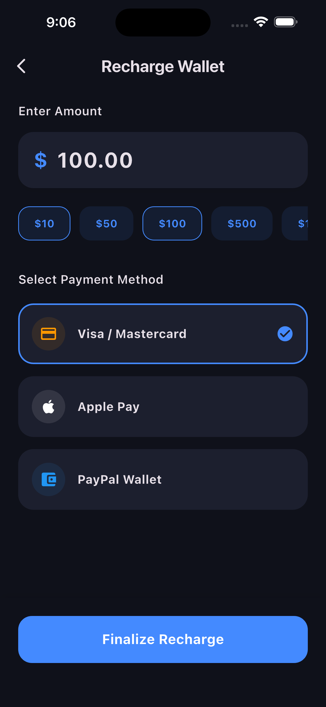
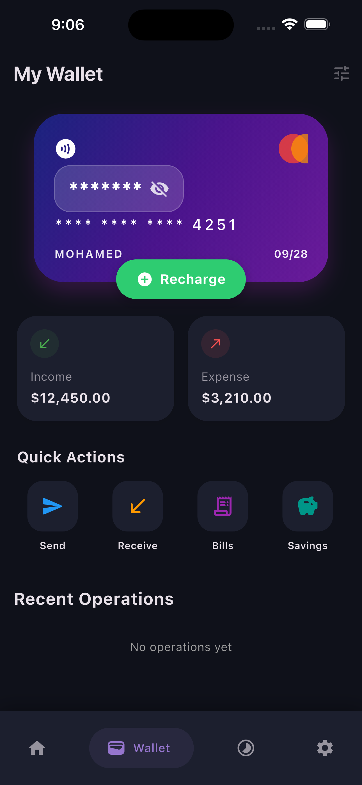

# 📱 Lenpay

<p align="center">
  
  <br>
  <b>A modern Chat and Financial Transactions application built with Flutter & Firebase.</b>
</p>

---

## 🚀 Overview
**Lenpay** is a sophisticated mobile application designed to bridge the gap between communication and financial operations. Featuring a sleek, minimalist UI with full **Dark Mode** support, it provides a seamless and high-performance experience powered by Flutter.

## ✨ Key Features
* **Secure Authentication:** Robust login system using Firebase Auth (Email/Password).
* **Real-time Messaging:** Instant chat capabilities powered by Cloud Firestore.
* **Modern UI/UX:** Minimalist design aesthetics with high-contrast elements and smooth transitions.
* **Efficient State Management:** Optimized data handling for a responsive user experience.

## 📸 Screenshots

|  |  |  |  |

## 🛠 Tech Stack
* **Framework:** [Flutter](https://flutter.dev)
* **Backend:** [Firebase](https://firebase.google.com) (Authentication, Firestore)
* **Language:** [Dart](https://dart.dev)

## ⚙️ Getting Started
To get a local copy up and running, follow these steps:

1.  **Clone the repository:**
    ```bash
    git clone https://github.com/Mohamed-Mewafy/lenpay.git
    ```
2.  **Navigate to the project directory:**
    ```bash
    cd lenpay
    ```
3.  **Install dependencies:**
    ```bash
    flutter pub get
    ```
4.  **Run the application:**
    ```bash
    flutter run
    ```

---

## 👨‍💻 Developer
**Mohamed Mewafy** *Building modern mobile experiences and high-performance web applications.*

---
